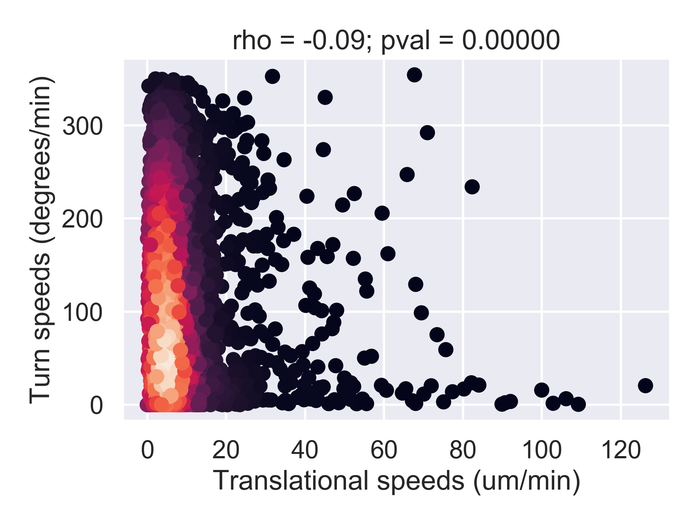

# motility_analysis

I started working on motility in around 2014.
This package represents a framework for the analysis of how agents move through 3D space.
The package's functionality has been expanded and updated over the years that I have been working on it.

## Technical

The framework is written in Python3, employing object-oriented design.
Each agent is tracked through space and time, and the path that it follows is captured as a `Track` object.
Tracks comprise `Positions` that capture location and some other summary statistics.
Usually many agents are observed simultaneously, and these are collected into a `Profile` of `Tracks`.

`build.py` contains a variety of methods for commencing an analysis.
The most typical analysis I have performed is to capture agent spatio-temporal position data as a CSV file.
Example files can be found in the `sample_data` directory, alongside example analyses.
Examples of how to use the package are found in the `tests` directory.

There is facility to contrasting several `profiles` (e.g. different experiments or populations of cells).
See the `contrast_profiles.py` module for details.

## History

This repository is relatively new, because the first iteration of the model was released as a ZIP file with the corresponding 2016 PLOS Computational Biology paper.
Since that time, this model (and theme of work) has contributed to the following papers.

> Hywood, J. D., Rice, G., Pageon, S. V, Read, M. N., & Biro, M. (2021). Detection and characterisation of chemotaxis without cell tracking. Journal of the Royal Society Interface, 18, 20200879.

> Galeano Niño, J. L., Pageon, S. V, Tay, S. S., Colakoglu, F., Kempe, D., Hywood, J., … Biro, M. (2020). Cytotoxic T cells swarm by homotypic chemokine signalling. ELife, 9, 1–40. https://doi.org/10.7554/elife.56554

> Moran, I., Nguyen, A., Khoo, W. H., Butt, D., Bourne, K., Young, C., … Phan, T. G. (2018). Memory B cells are reactivated in subcapsular proliferative foci of lymph nodes. Nature Communications, 9(1), 3372. https://doi.org/10.1038/s41467-018-05772-7

> Read, M. N., Bailey, J., Timmis, J., & Chtanova, T. (2016). Leukocyte Motility Models Assessed through Simulation and Multi-objective Optimization-Based Model Selection. PLOS Computational Biology, 12(9), e1005082. https://doi.org/10.1371/journl.pcbi.1005082

> Hywood, J. D., Read, M. N., & Rice, G. (2016). Statistical analysis of spatially homogeneous dynamic agent-based processes using functional time series analysis. Spatial Statistics, 17, 199–219. https://doi.org/10.1016/j.spasta.2016.06.002

Code is made available under the GNU General Public License version 3.

## Author

If you have any questions about this code, or how to apply it to your own data, please get in contact.

`motility_analysis` was written by `Mark N. Read <mark.norman.read@gmail.com>`_.
